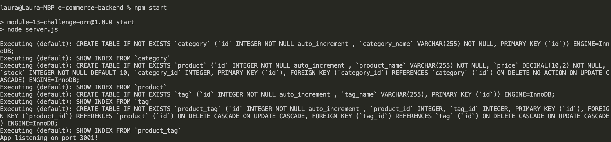

# Backend for an E-Commerce Site
[](https://opensource.org/licenses/MIT)

## Description
This application functions as the back end for an e-commerce site. This program uses Express.js APIs to use Sequelize to interact with a MySQL database. By starting the server with a database and populated tables for categories, products, tags, and a table that associated the products and tags, the user is able to manipulate this data by adding to it, updating it, and deleting from it.

Here's the link to how it works: [click here](https://youtube.com/playlist?list=PLiAcGpnOWXwsTVlCKho8SgTQz4SKSkUy7).

## Screenshots
How the application looks on the terminal:


# Table of Contents
* [Installation](#installation)
* [Usage](#usage)
* [License](#license)
* [Contributing](#contributing)
* [Technologies Used](#technologies-used)
* [Code Snippets](#code-snippets)
* [Questions](#questions)
* [User Information](#user-information)

## Installation
To install necessary dependencies, run the following command:
```
npm i
```
To create the database, since into your MySQL shell and run the following command:
```
source ./db/schema.sql
```
To populate the table, run the following command after exiting the shell:
```
npm run seed
```

## Usage
Install the dependencies and you're ready to go.

## License 
This project is licensed under the MIT license.

## Contributing
Contact me.

## Technologies Used
- Node.js
- Inquirer
- MySQL
- Sequelize

## Code Snippets
```javascript
// CREATE new product
router.post('/', (req, res) => {
  /* req.body should look like this...
    {
      product_name: "Basketball",
      price: 200.00,
      stock: 3,
      tagIds: [1, 2, 3, 4]
    }
  */
  Product.create(req.body)
    .then((product) => {
      // if there's product tags, we need to create pairings to bulk create in the ProductTag model
      if (req.body.tagIds.length) {
        const productTagIdArr = req.body.tagIds.map((tag_id) => {
          return {
            product_id: product.id,
            tag_id,
          };
        });
        return ProductTag.bulkCreate(productTagIdArr);
      }
      // if no product tags, just respond
      res.status(200).json(product);
    })
    .then((productTagIds) => res.status(200).json(productTagIds))
    .catch((err) => {
      console.log(err);
      res.status(400).json(err);
    });
});
```
When the user submits a PUT request, the JSON object needs to contain all the information necessary for a successful creation (as seen as the beginning of the post method). One of these keys is `tagIds`, which is an array of the ids of the tags we want to be linked to this product. Subsequently, we want to iterate through this array to create the connection between the Product model and the Tag model (which takes place through the ProductTag model).


## Questions
If you have any questions about the repo, open an issue or contact me directly at laura.sierra17@gmail.com.
You can find more of my work at [laurasierra17](https://www.github.com/laurasierra17).

## User Information
- [LinkedIn](https://www.linkedin.com/in/laurasierra2022)
- [Portfolio](http://www.laura-sierra.com)